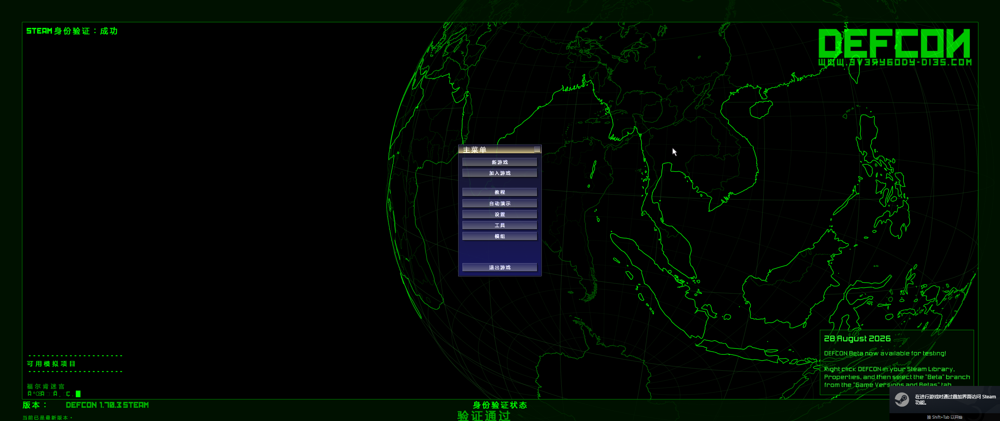
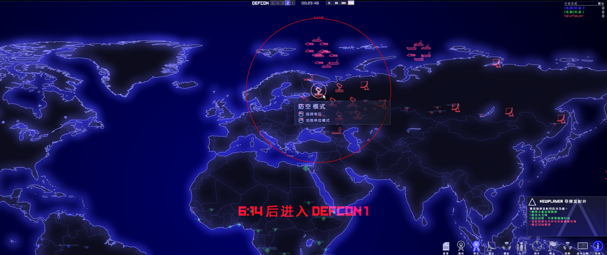

# DEFCON 简体中文汉化

**本项目为非官方、非商业的 DEFCON 简体中文本地化项目，与 Introversion Software Limited 无隶属或授权关系。DEFCON 及相关内容的权利归其各自权利人所有。本项目需要用户自行拥有正版 DEFCON。**





为 DEFCON 提供简体中文界面，覆盖菜单、游戏提示、单位说明与教程。

## 运行要求

- Windows 10 或更新版本，64 位系统。
- Steam 版 DEFCON 1.70.3，64 位游戏程序。
- Microsoft YaHei（微软雅黑）字体，或其他已配置的中文字体。

其他发行版本及测试分支不在当前支持范围内。

## 安装与启动

1. 退出 DEFCON，并启动 Steam。
2. 将发布包中的文件复制到 `Defcon.exe` 所在目录，保留 `data/defconcn` 的目录结构。
3. 双击 `DefconCNLaunch.exe` 启动游戏。

安装后的主要文件：

```text
Defcon/
  Defcon.exe
  DefconCNLaunch.exe
  DefconCNProof.dll
  data/
    defconcn/
      chinese.txt
      config.ini
  licenses/
    MinHook.txt
  README.md
```

若自动启动超时，可先从 Steam 启动 DEFCON，等待主菜单出现后，再双击汉化启动器。

## 汉化范围

- 主菜单及各项设置。
- 联机大厅、服务器列表、联盟与聊天提示。
- 游戏规则、计分说明、单位信息及操作提示。
- 七章教程、模组提示和背景信息。

姓名、网址、产品名称和部分技术标识保留原文。地图城市与国家名称、部分固定文本暂未汉化。中文输入法、聊天和昵称输入不属于本项目的适配范围。

## 字体设置

字体配置位于 `data/defconcn/config.ini`：

```ini
[Font]
Family=Microsoft YaHei
Weight=600
```

`Family` 填写字体家族名称。`Weight` 控制笔画粗细，范围为 100 至 900；400 为常规，600 为半粗，700 为粗体，实际效果取决于字体支持情况。

也可将有使用授权的 `font.ttf` 放入 `data/defconcn`，并填写该字体实际的家族名称。修改配置后，完全退出并重新启动游戏。

## 自定义翻译

`data/defconcn/chinese.txt` 使用 UTF-8 编码，每行由语言键和译文组成：

```text
dialog_newgame                               新游戏
dialog_options                               设置
dialog_chapter                               第 *C 章
```

仅修改键后面的译文，保留键名、`*C` 等占位符及 `\n` 换行转义。鼠标标记 `[LMB]`、`[RMB]` 用于显示按钮图标，请保持原样。以 `#` 开头的行是注释。

修改译文后，重新启动游戏即可生效。

## 常见问题

### 界面没有显示中文

确认通过 `DefconCNLaunch.exe` 启动，且 DLL 和 `data/defconcn` 已放到正确位置。启动器与游戏应使用相同权限。文件齐全后，完全退出游戏并重新启动。

### 字体或文字显示异常

检查配置的字体是否可用。自行修改语言文件时，请使用 UTF-8 编码，并保留占位符、换行转义和鼠标标记。更换图形接口或显示设置后，建议重新启动游戏。

### 启动器报错

检查游戏版本及发布包文件是否完整。错误框会显示失败步骤和错误代码；日志位于 `%TEMP%\DefconCN-poc-进程ID.log`。可在资源管理器地址栏输入 `%TEMP%` 查找。

反馈问题时，请附上游戏版本、问题截图及对应日志。

## 已知限制

部分界面的长文本排版仍可能需要调整，完整对局及图形设备重建后的显示兼容性尚未全面验证。

## 卸载

退出游戏后，删除 `DefconCNLaunch.exe`、`DefconCNProof.dll` 和 `data/defconcn` 即可。不要删除游戏原有的 `data` 文件夹。

## 从源码构建

需要 Visual Studio 2022 的 C++ 桌面开发工具、Windows SDK 和 CMake，使用 x64 配置：

```powershell
cmake -S . -B build -A x64
cmake --build build --config Release
```

运行文件输出到 `bin`，语言资源、说明和第三方许可证会自动复制。普通发布包包含 `DefconCNLaunch.exe`、`DefconCNProof.dll`、`data/defconcn`、`README.md` 和 `licenses`。

翻译源文件位于 `assets/defconcn/chinese.txt`，构建时复制到 `bin/data/defconcn`。需要永久保留的译文修改应写入 `assets`。

## 第三方组件

项目使用 MinHook。源码中的版权与许可证文件位于 `third_party/minhook/LICENSE.txt`，发布包附有 `licenses/MinHook.txt`。分发时请保留这些声明。
